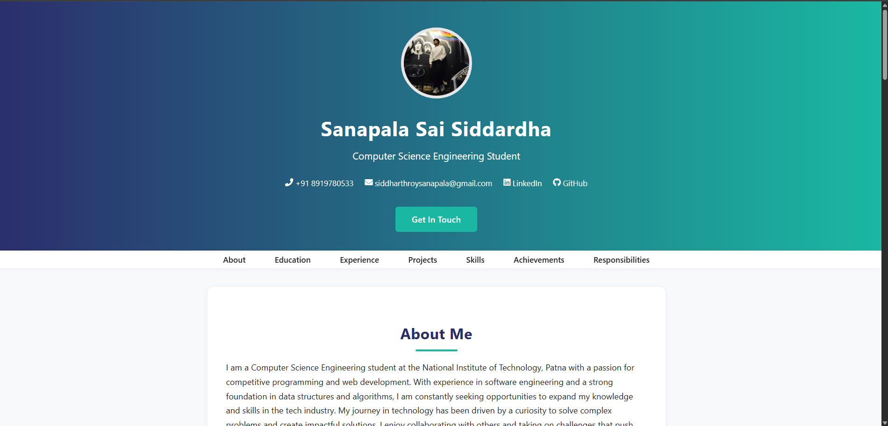

# Sanapala Sai Siddhartha - Portfolio

A modern, responsive personal portfolio website built with HTML and CSS.  
Showcases my education, experience, projects, technical skills, achievements, and contact information.

## 🚀 Features

- **Responsive Design:** Looks great on desktop and mobile devices.
- **Modern UI:** Clean layout, card-based sections, and smooth hover effects.
- **Projects Showcase:** Highlights key projects with tech tags and links.
- **Skills & Achievements:** Organized display of technical skills and certifications.
- **Contact Section:** Users can send you a message via their default email app.
- **Accessible:** Uses semantic HTML and accessible link labels.
- **Social Links:** Quick access to LinkedIn, GitHub, LeetCode, and CodeChef.

## 📸 Preview



## 🛠️ How to Use

1. **Clone the repository:**
    ```bash
    git clone https://github.com/yourusername/your-portfolio-repo.git
    cd your-portfolio-repo
    ```

2. **Add your assets:**
    - Replace `profile_sid.jpg` with your own profile picture.
    - Replace `icon.png` with your favicon (or use `favicon.ico`).

3. **Customize content:**
    - Edit `index.html` to update your details, projects, and links.
    - Edit `styles.css` to tweak colors or layout if desired.

4. **Open in browser:**
    - Simply open `index.html` in your web browser.

## 🌐 Deployment

You can deploy this portfolio easily using:
- [Netlify](https://www.netlify.com/)

## 📄 License

This project is open source and available under the [MIT License](LICENSE).

---

**Made with ❤️ by Sanapala Sai Siddhartha**
